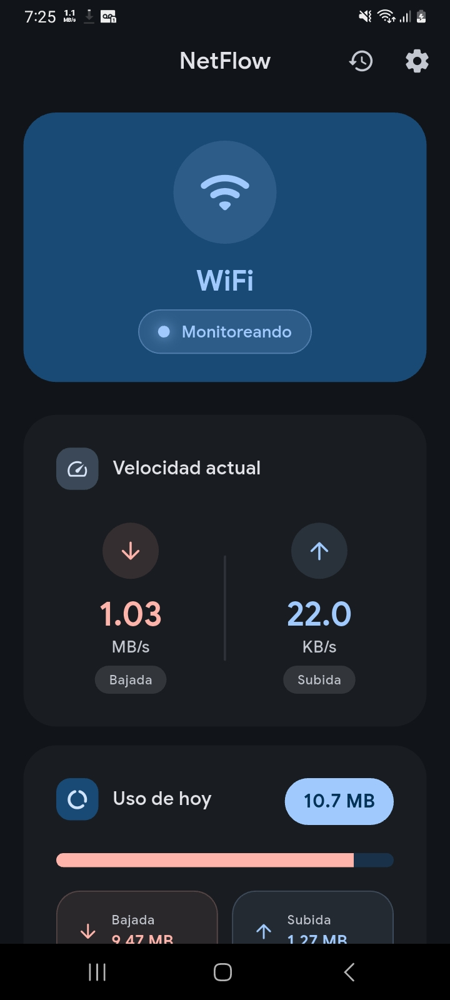

# NetFlow

Aplicacion Android para monitorear en tiempo real el consumo y la velocidad de datos en WiFi y red movil, con notificacion persistente, historial diario y alertas de limite.

## Capturas

### Home



## Caracteristicas principales

- Velocidad de red en tiempo real (bajada/subida) en bytes/s o bits/s.
- Notificacion persistente con actualizacion continua y icono dinamico.
- Deteccion automatica del tipo de conexion (WiFi o datos moviles).
- Historial diario de consumo con graficos.
- Limite de datos configurable con alertas al alcanzar el umbral.
- Monitoreo en segundo plano con servicio foreground.
- Inicio automatico tras reinicio del dispositivo.
- Actualizaciones via GitHub Releases.
- Interfaz Material Design 3 con soporte Dynamic Color.

## Requisitos

- Minimo: Android 8.0 (API 26).
- Recomendado: Android 12+ (API 31).
- Target SDK: Android 15 (API 35).

## Permisos

### Solicitados al usuario

| Permiso | Tipo | Motivo |
|---------|------|--------|
| `READ_PHONE_STATE` | Requerido | Monitorear uso de datos moviles |
| `POST_NOTIFICATIONS` (Android 13+) | Requerido | Mostrar velocidad y alertas |
| `ACCESS_FINE_LOCATION` | Opcional | Obtener SSID de la red WiFi |
| `ACCESS_BACKGROUND_LOCATION` (Android 10+) | Opcional | Mantener SSID visible en segundo plano |
| `IGNORE_BATTERY_OPTIMIZATIONS` | Opcional | Reducir cortes del servicio en background |

### Declarados automaticamente

`INTERNET`, `ACCESS_NETWORK_STATE`, `ACCESS_WIFI_STATE`, `FOREGROUND_SERVICE`, `FOREGROUND_SERVICE_DATA_SYNC`, `RECEIVE_BOOT_COMPLETED`, `WAKE_LOCK`, `PACKAGE_USAGE_STATS`

## Uso rapido

1. Instala la app.
2. Otorga permisos requeridos (telefono y notificaciones).
3. Si quieres ver SSID en notificacion, activa ubicacion y permite ubicacion en segundo plano.
4. Abre Opciones avanzadas y excluye la app del ahorro de bateria para mayor estabilidad.

## Solucion de problemas

### El SSID no aparece en la notificacion

- Verifica que la ubicacion del sistema este activada.
- Confirma permiso de ubicacion y, para segundo plano, permiso todo el tiempo.
- Revisa que no haya restricciones de bateria para la app.

### El servicio se detiene en segundo plano

- Activa la excepcion de optimizacion de bateria.
- Evita modos agresivos de ahorro de energia del fabricante.

### Fallos de build por cache de Gradle/Kotlin (Windows)

- Ejecuta `gradlew --stop` dentro de `android`.
- Limpia `build`, `android/.gradle`, `android/.kotlin` y caches de `C:\Users\<usuario>\.gradle\caches`.
- Ejecuta `flutter clean` y luego `flutter pub get`.

## Arquitectura

- Monitoreo en background mediante `TaskHandler` (isolate separado).
- Persistencia local en SQLite para consumo diario.
- Plugin local `netflow_traffic_stats` para acceso nativo a `TrafficStats` y notificaciones nativas.

## Desarrollo

```bash
flutter pub get
flutter analyze
flutter test
flutter run -d <device_id>
```

## Build de release

```bash
flutter pub get
flutter build apk --release
```

## Instalacion

1. Descargar APK desde [GitHub Releases](https://github.com/dony-aep/netflow/releases)
2. Instalar en el dispositivo
3. Conceder permisos al abrir la app

## Licencia

MIT. Ver [LICENSE](LICENSE).
