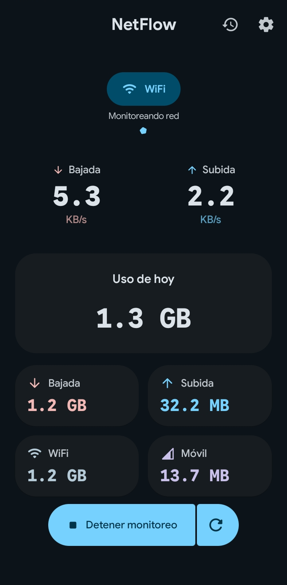

# NetFlow

Aplicacion Android nativa para monitorear en tiempo real el consumo y la velocidad de datos en WiFi y red movil, con notificacion persistente, historial diario y alertas de limite.

Desarrollada en **Kotlin** con **Jetpack Compose** y **Material 3 Expressive**.

## Capturas de pantalla

<p align="center">
  
</p>

## Caracteristicas principales

- Velocidad de red en tiempo real (bajada/subida) en bytes/s o bits/s.
- Notificacion persistente con actualizacion continua y icono dinamico.
- Deteccion automatica del tipo de conexion (WiFi o datos moviles).
- Historial diario de consumo con calendario y resumen por periodo.
- Limite de datos mensual configurable con ciclo de facturacion y alerta al superar el umbral.
- Monitoreo en segundo plano con servicio foreground.
- Inicio automatico tras reinicio del dispositivo.
- Actualizaciones via GitHub Releases.
- Interfaz Material 3 Expressive con Dynamic Color y MotionScheme.
- Tipografia Google Sans / Google Sans Code.

## Stack tecnologico

| Capa | Tecnologia |
|------|-----------|
| UI | Jetpack Compose + Material 3 Expressive |
| Navegacion | Navigation Compose |
| Estado | StateFlow + ViewModel |
| Persistencia | Room + DataStore Preferences |
| Concurrencia | Kotlin Coroutines |
| Red | TrafficStats API + ConnectivityManager |
| Actualizaciones | GitHub Releases API |
| Build | Gradle KTS + KSP |

## Requisitos

- Minimo: Android 8.0 (API 26).
- Recomendado: Android 12+ (API 31) para Dynamic Color.
- Target SDK: Android 15 (API 36).

## Permisos

### Solicitados al usuario

| Permiso | Tipo | Motivo |
|---------|------|--------|
| `POST_NOTIFICATIONS` (Android 13+) | Requerido | Mostrar velocidad y alertas |
| `ACCESS_FINE_LOCATION` | Opcional | Obtener SSID de la red WiFi |
| `ACCESS_BACKGROUND_LOCATION` (Android 10+) | Opcional | Mantener SSID visible en segundo plano |
| `REQUEST_IGNORE_BATTERY_OPTIMIZATIONS` | Opcional | Reducir cortes del servicio en background |

### Declarados automaticamente

`INTERNET`, `ACCESS_NETWORK_STATE`, `ACCESS_WIFI_STATE`, `ACCESS_COARSE_LOCATION`, `READ_PHONE_STATE`, `FOREGROUND_SERVICE`, `FOREGROUND_SERVICE_DATA_SYNC`, `RECEIVE_BOOT_COMPLETED`, `WAKE_LOCK`

## Arquitectura

```
app/
├── core/
│   ├── monitoring/       # Service, BroadcastReceiver, StateStore
│   ├── notification/     # NotificationFactory, DynamicSpeedIcon
│   └── update/           # GitHubUpdateService
├── data/
│   ├── local/            # Room DB, DAO, DataStore, TrafficStats
│   ├── model/            # Data classes (AppSettings, DailyUsage, etc.)
│   └── repository/       # Repository interfaces + implementations
└── ui/
    ├── navigation/       # NavHost, Destinations
    ├── screens/          # Home, History, Settings, Advanced, Updates, About
    └── theme/            # Color, Shape, Type, Theme (M3 Expressive)
```

## Uso rapido

1. Instala la app.
2. Otorga permiso de notificaciones.
3. El monitoreo inicia automaticamente.
4. Si quieres ver el SSID en la notificacion, activa ubicacion y permite ubicacion en segundo plano.
5. Abre Opciones avanzadas y excluye la app del ahorro de bateria para mayor estabilidad.

## Solucion de problemas

### El SSID no aparece en la notificacion

- Verifica que la ubicacion del sistema este activada.
- Confirma permiso de ubicacion y, para segundo plano, permiso "todo el tiempo".
- Revisa que no haya restricciones de bateria para la app.

### El servicio se detiene en segundo plano

- Activa la excepcion de optimizacion de bateria.
- Evita modos agresivos de ahorro de energia del fabricante.

## Desarrollo

```bash
# Compilar debug
./gradlew assembleDebug

# Ejecutar tests
./gradlew test

# Lint
./gradlew lint
```

## Build de release

```bash
./gradlew assembleRelease
```

La APK firmada se genera en `app/build/outputs/apk/release/`.

Requiere `app/key.properties` con la configuracion de firma (ver documentacion de signing).

## Instalacion

1. Descargar APK desde [GitHub Releases](https://github.com/dony-aep/netflow/releases)
2. Instalar en el dispositivo
3. Conceder permisos al abrir la app

## Licencia

MIT. Ver [LICENSE](LICENSE).
