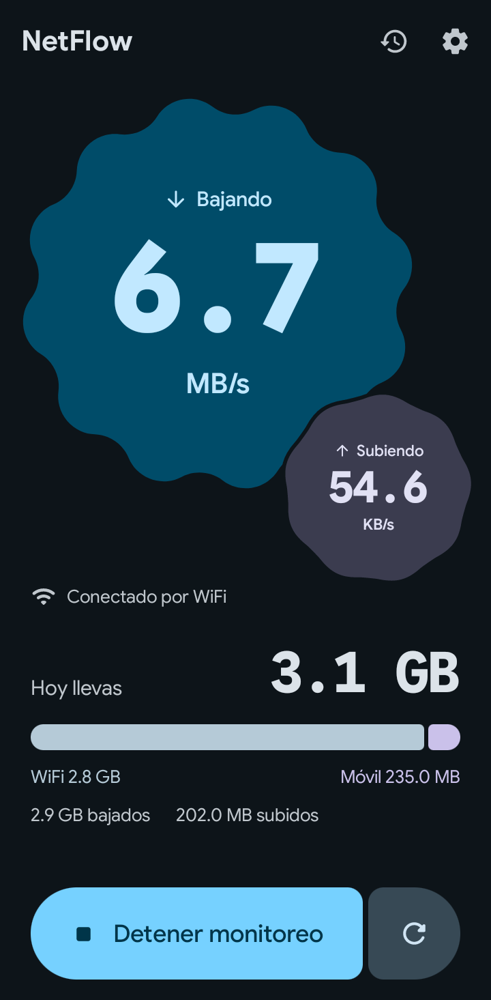
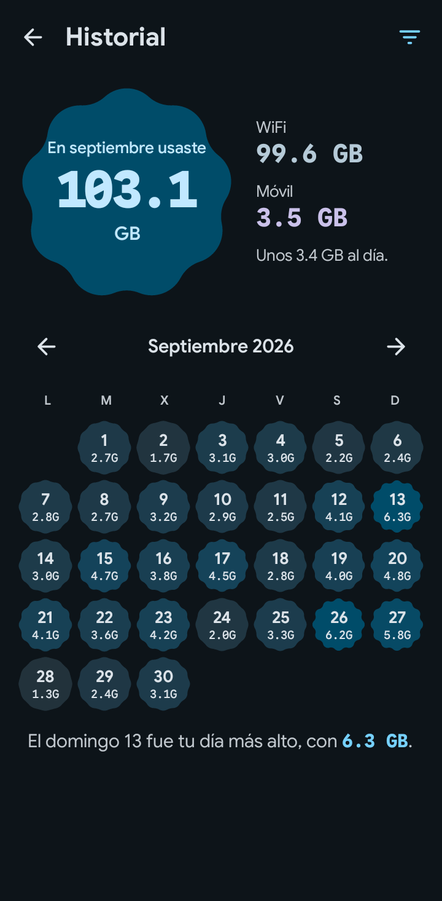
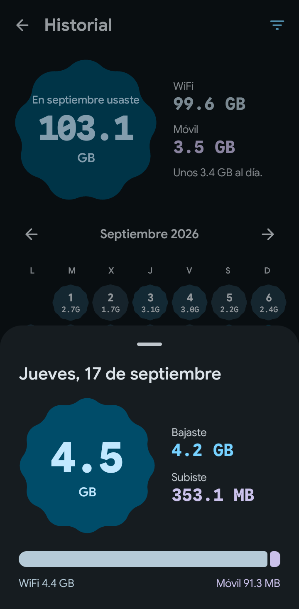
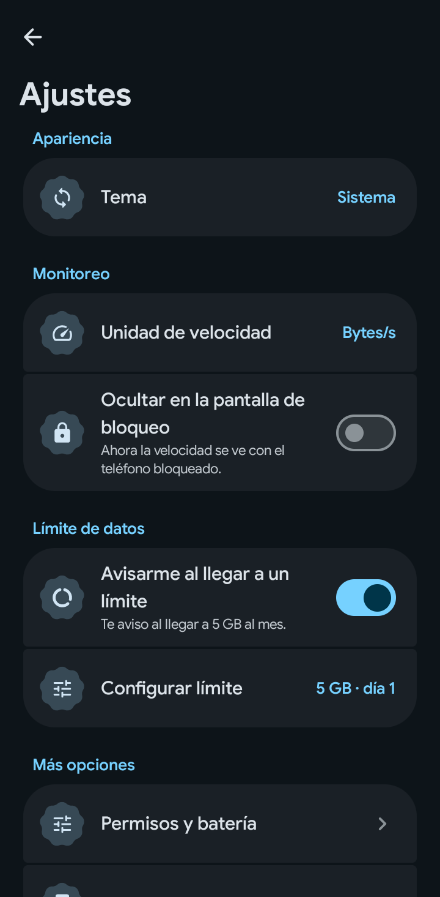
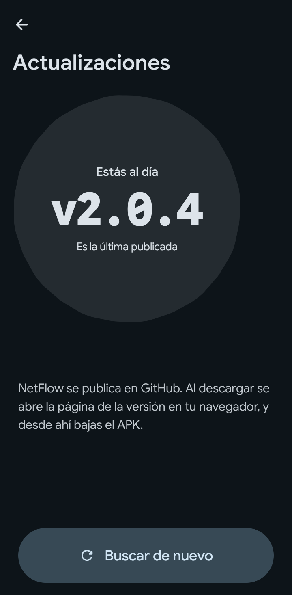

# NetFlow

Aplicación Android nativa que mide en tiempo real la velocidad y el consumo de datos en WiFi y red móvil. Mantiene una notificación con la velocidad, guarda un historial diario y avisa al superar el límite de datos.

Desarrollada en **Kotlin** con **Jetpack Compose** y **Material 3 Expressive**.

## Capturas de pantalla

<p align="center">
  
  
  
</p>

| Inicio | Historial | Detalle de un día |
|:------:|:---------:|:-----------------:|
| Velocidad en vivo y consumo de hoy | El mes en un calendario, con el día más alto | Bajada, subida y reparto entre WiFi y móvil |

<p align="center">
  
  
</p>

| Ajustes | Actualizaciones |
|:-------:|:---------------:|
| Tema, unidad de velocidad y límite de datos | Versión instalada y última publicada en GitHub |

Las capturas usan datos de demostración.

## Características principales

- Velocidad de bajada y de subida en vivo, en bytes/s o bits/s.
- Una figura que cambia de forma con la velocidad: casi redonda en reposo, ondulada cuando hay tráfico.
- Notificación persistente con la velocidad dibujada en el icono. Se puede ocultar en la pantalla de bloqueo.
- Consumo de hoy repartido entre WiFi y datos móviles.
- Historial con calendario por mes y resúmenes de 7 días, 30 días y 3 meses.
- Límite mensual de datos móviles con día de inicio de ciclo y aviso al superarlo.
- Monitoreo en segundo plano con un servicio en primer plano. Si estaba activo, se retoma al reiniciar el teléfono.
- Consulta de versiones nuevas en GitHub Releases desde la propia app.
- Tema claro, oscuro o el del sistema, con Dynamic Color en Android 12 o superior.
- Tipografía Google Sans y Google Sans Code.

## Stack tecnológico

| Capa | Tecnología |
|------|-----------|
| UI | Jetpack Compose + Material 3 Expressive |
| Navegación | Navigation Compose |
| Estado | StateFlow + ViewModel |
| Persistencia | Room + DataStore Preferences |
| Concurrencia | Kotlin Coroutines |
| Red | TrafficStats API + ConnectivityManager |
| Actualizaciones | GitHub Releases API |
| Build | Gradle KTS + KSP |

## Requisitos

- Mínimo: Android 8.0 (API 26).
- Recomendado: Android 12 (API 31) o superior, para Dynamic Color.
- Target SDK: API 36 (Android 16).

## Permisos

### Solicitados al usuario

| Permiso | Tipo | Motivo |
|---------|------|--------|
| `POST_NOTIFICATIONS` (Android 13+) | Necesario | Mostrar la velocidad y los avisos |
| `ACCESS_FINE_LOCATION` | Opcional | Leer el nombre de la red WiFi |
| `ACCESS_BACKGROUND_LOCATION` (Android 10+) | Opcional | Seguir leyendo ese nombre con la app en segundo plano |
| `REQUEST_IGNORE_BATTERY_OPTIMIZATIONS` | Opcional | Evitar que el sistema corte el servicio |

### Otros permisos declarados

`INTERNET`, `ACCESS_NETWORK_STATE`, `ACCESS_WIFI_STATE`, `ACCESS_COARSE_LOCATION`, `FOREGROUND_SERVICE`, `FOREGROUND_SERVICE_SPECIAL_USE`, `RECEIVE_BOOT_COMPLETED`

## Privacidad

- El consumo y los ajustes se guardan solo en el teléfono, en Room y DataStore.
- La app se conecta a internet únicamente al abrir Actualizaciones, y lo hace a la API de GitHub para leer la última versión publicada.
- La ubicación sirve para leer el nombre de la red WiFi, porque Android no lo entrega sin ese permiso. La app no la guarda ni la envía.
- No lleva analíticas ni publicidad.

## Arquitectura

```
app/src/main/java/com/donyaep/netflow/
├── core/
│   ├── monitoring/       # Servicio, contabilidad del tráfico, ciclo de facturación, arranque tras reinicio
│   ├── notification/     # Notificación e icono de velocidad
│   └── update/           # Consulta a GitHub Releases
├── data/
│   ├── local/            # Room, DataStore, TrafficStats
│   ├── model/            # AppSettings, DailyUsage, TrafficSnapshot
│   └── repository/       # Repositorios de ajustes, consumo diario y tráfico
└── ui/
    ├── components/       # Figura de pulso, reparto WiFi/móvil y filas compartidas
    ├── navigation/       # NavHost y destinos
    ├── screens/          # Inicio, Historial, Ajustes, Permisos y batería, Actualizaciones, Acerca de
    └── theme/            # Color, Shape, Type, Theme
```

## Uso rápido

1. Instala la app.
2. Acepta el permiso de notificaciones. El monitoreo empieza al abrir la app.
3. Para ver el nombre de la red WiFi, entra en Ajustes > Permisos y batería, concede la ubicación y elige «Permitir todo el tiempo».
4. En esa misma pantalla, excluye la app de la optimización de batería para que el sistema no corte el servicio.

## Solución de problemas

### El nombre de la red WiFi no aparece

- Verifica que la ubicación del sistema esté activada.
- Confirma el permiso de ubicación y, para el segundo plano, la opción «Permitir todo el tiempo».
- Revisa que la app no tenga restricciones de batería.

### El servicio se detiene en segundo plano

- Excluye la app de la optimización de batería.
- Evita los modos agresivos de ahorro de energía del fabricante.

## Desarrollo

```bash
# Compilar debug
./gradlew :app:assembleDebug

# Ejecutar las pruebas unitarias
./gradlew :app:testDebugUnitTest

# Lint
./gradlew :app:lintDebug
```

La build de depuración se instala como `com.donyaep.netflow.debug`, así que convive en el mismo teléfono con la release.

## Build de release

```bash
./gradlew :app:assembleRelease
```

La APK se genera en `app/build/outputs/apk/release/`.

Para firmarla hace falta `app/key.properties`, que no está en el repositorio:

```properties
storeFile=ruta/al/keystore.jks
storePassword=...
keyAlias=...
keyPassword=...
```

`storeFile` se resuelve desde la carpeta `app/`. Si el archivo falta, Gradle firma la release con la clave de depuración.

## Instalación

1. Descarga la APK desde [GitHub Releases](https://github.com/dony-aep/netflow/releases).
2. Instálala en el dispositivo.
3. Concede los permisos al abrir la app.

## Licencia

MIT. Ver [LICENSE](LICENSE).
